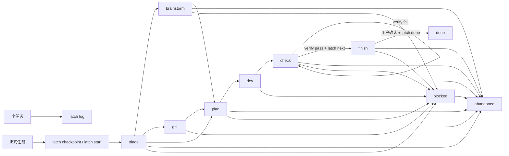

# Latch 使用手册

Latch 是一个项目内任务状态锁存器，用在 AI coding 任务碰到风险域、需要跨会话续接，或者低估为小修后变长的时候。小修、解释代码、单点文案不进入 Latch。

同一项目可以同时保留多个 open task。默认任务不再是全局唯一，而是每个 actor 各有自己的 current task。命令默认操作当前 actor 的 current task；需要操作其他任务时使用 `--task <id>`，切换默认任务时执行 `latch use <id>`。

常见触发语、初始阶段和 checkpoint 示例见 `docs/SCENARIOS.md`。
文档分层见 `docs/ARTIFACTS.md`：`task.json`/`notes.md` 不是 PRD，正式方案文档单独放在 `docs/briefs/` 或 `docs/prd/`。

## 什么时候进入 Latch

完整触发规则见 `AGENTS.md`（本项目触发正文的出处）。手册这里只补一个操作细节：

- 准备进入 Latch 前，先用 `latch list --json --brief` 查 open task；同题任务优先续接，确实没有再新建。
- 能在动手前识别为风险域的任务，动手前就 `latch checkpoint`。
- 低估为小修、做着做着变长的，立刻中途 `checkpoint` 补记现场——「任务变长时进入」只适用于这种补记。

## 一句话规则

任务一旦进入 Latch，就按「记录现场 -> 推进阶段 -> 真实验证 -> 等用户确认 -> 归档」走完。`log` 只给不需要跨会话续接的小任务留一行记录。

## 命令清单

| 命令 | 用途 | 关键点 |
| --- | --- | --- |
| `latch init` | 初始化 `.latch/` | 通常只需执行一次。 |
| `latch start "<title>"` | 创建正式任务 | 可创建多个 open task；没有当前 actor 的 current 时自动设为 current。 |
| `latch use <task-id> [--force]` | 切换当前 actor 的默认任务 | 默认只允许切到自己拥有的任务；`--force` 会接管 owner。 |
| `latch checkpoint "<title>" ...` | 低摩擦进入 Latch | 没当前 actor 的 current 就创建；有 current 时，不带标题才会追加字段；带标题必须配 `--new`；`--new` 强制新建，不推进阶段。 |
| `latch save ...` | 保存当前阶段字段 | 只记账，不推进阶段；也可写知识记忆判断和 artifacts 指针。 |
| `latch finish ...` | 一次写完收尾信息 | 在 `finish` 阶段可用；如果当前在 `check` 且 verify 已通过，会自动进入 `finish`。可同时写 closure、知识记忆判断和 artifacts。 |
| `latch next [--to <stage>]` | 推进阶段 | 会检查阶段门禁；进入 `brainstorm`、`grill`、`finish` 时写入模板。 |
| `latch verify -- <command>` | 运行验证命令 | 真实执行命令，按退出码记录 `pass` 或 `fail`。 |
| `latch resume` | 续接当前任务 | 输出任务字段和 `notes.md` 全文。 |
| `latch resume --brief` | 人读短摘要 | 输出任务字段、最近 5 条 events 和 notes 路径。人续接时优先用这个；AI 默认入口用 `context --json --brief`。 |
| `latch list` | 查看未归档任务 | 列出 `.latch/tasks/` 下的任务，`*` 标出当前 actor 的 current，并显示 owner。 |
| `latch context [task-id]` | 输出任务上下文 | AI 默认入口用 `--json`；也供人读和看板。 |
| `latch log "<summary>"` | 小任务留痕 | 不创建任务，不进状态机。 |
| `latch abandon [--reason "..."]` | 放弃当前任务 | 任意阶段可用，归档现场。 |
| `latch done [--task <task-id>|--all --yes] [--force]` | 归档任务 | 单任务模式只允许在 `finish` 且满足验证门禁时执行；纯文档/commit 跳级任务可无 verify。`--all --yes` 会批量归档所有已满足门禁的 `finish` 任务。 |
| `latch knowledge ...` | 生成和召回知识卡 | v1 只服务当前 repo 的 AI coding 续接。 |

所有 `.latch/` 路径都基于运行 `latch` 时的当前目录。通常在仓库根执行；在子目录执行会在子目录创建独立 `.latch/`。

显式 task ID 支持完整目录名，也支持唯一前缀；如果命中多个 open task，会报歧义错误，要求改用更长的 ID。

## 常用流程

### 任务变长时进入 Latch

```bash
latch checkpoint "修复登录态过期跳转" \
  --goal "过期登录态统一跳转登录页" \
  --scope "前端路由和接口错误处理" \
  --acceptance "pnpm test 通过；过期后跳登录页" \
  --next "补登录过期跳转测试"
```

`checkpoint` 不代表进入开发阶段。它只锁住现场，默认停在 `triage`。

如果当前已经有别的任务，但这次是另一件新事，显式新建：

```bash
latch checkpoint "修复 agent 抢 current task" --new \
  --goal "从根源修复多 agent 抢 current task"
```

### 多任务切换

```bash
latch start "修复登录态过期跳转"
latch start "接入看板上下文"
latch list
latch use 2026-07-01-0900-接入看板上下文
```

`start` 可以创建多个 open task。每个 actor 第一个任务会成为它自己的 current task；之后创建的新任务不会自动抢走当前 actor 的 current，除非使用 `--use`：

```bash
latch start "接入看板上下文" --use
```

`resume`、`save`、`next`、`verify`、`done` 和 `abandon` 默认操作当前 actor 的 current task。临时操作其他任务时使用：

```bash
latch next --task 2026-07-01-0900-修复登录态过期跳转
```

### 多 agent 协作

- 每个 agent 要有稳定的 actor 标识。CLI 默认读取 `LATCH_ACTOR`；在 Codex 里没有显式设置时，会退回 `CODEX_THREAD_ID`；两者都没有时会使用 `default`。推荐把 `LATCH_ACTOR` 写成 `<tool>:<agent>:<session>`，至少包含 `<tool>:<session>`，例如 `codex:default:019f3bf3`、`claude:planner:local`、`opencode:default:run-12`。Claude Code、OpenCode 等没有稳定线程 ID 的环境应显式设置 `LATCH_ACTOR`，避免多个会话共用同一个 current task，也避免看板里只剩裸 ID。
- task 会记录 `owner`。默认只能读写自己拥有的任务。
- 需要接手别的 agent 任务时，显式执行：

```bash
latch use <task-id> --force
```

或：

```bash
latch save --task <task-id> --force --next "..."
```

`--force` 会把 owner 改成当前 actor。没有 `--force` 时，不同 agent 不会互相抢默认任务，也不会静默写进别人的任务。

### 正常开发流程

```bash
latch context --json --brief
latch next
latch save --next "实现最小改动"
latch next
# 修改代码
latch next
latch verify -- pnpm test
latch finish --changes "..." --verified "pnpm test" --unverified "无" --followup "等用户确认后 done"
```

验证通过后任务停在 `finish`。只有用户明确确认收尾、完成或归档时，才执行：

```bash
latch done
```

`git commit`、`git push` 和 `latch done` 都不属于默认后续动作。AI 只有在用户明确说「提交」「推送」或「归档」后，才可执行这些命令。

### 知识记忆 v1

```bash
latch knowledge generate --draft --module cli --keyword resume --path src/cli.ts --symbol currentTask
latch knowledge recall --file src/cli.ts
latch knowledge refresh-modules
latch knowledge verify --all
```

- 任务知识卡是真源，落在 `.latch/knowledge/tasks/`
- 模块卡是派生视图，落在 `.latch/knowledge/modules/`
- 知识卡格式固定为 `md + YAML frontmatter`
- 正式知识卡只在 `finish` 阶段生成，且最近 verify 必须是 `pass`
- `--draft` 允许提前生成草稿卡
- 默认召回顺序是：文件路径 -> 关键词 -> 模块卡；没有命中时返回无匹配
- v1 不建向量库，不接 MindOS，不做重 UI
- 验证通过后补 closure；推荐直接用 `latch finish --changes "..." --verified "..." --unverified "..." --followup "..."` 一次写完。当前在 `check` 且 verify 已通过时，`finish` 会自动进入 `finish` 阶段
- 知识记忆默认 skip。需要沉淀规则时，用 `latch finish ... --knowledge generate --knowledge-reason "..."` 或 `latch save --knowledge generate --knowledge-reason "..."`
- 只有判断为 `generate` 时，才要求先执行 `latch knowledge generate` 再 `done`

### 放弃当前任务

```bash
latch abandon --reason "影响面太大，暂不继续"
```

`abandon` 用于任务开错、方向变化或外部条件等不到时退出。它不检查阶段和 verify，`blocked` 任务也能直接放弃。原因可选；传入原因时会写入 `events.jsonl` 和 `notes.md`。任务会归档到 `.latch/archive/YYYY-MM/`，已有 verify 结果原样保留。

归档的不是当前 actor 的 current task 时，当前 actor 的默认任务不变。归档后，所有指向这个 task 的 actor current 都会被清掉；需要继续其他任务时执行 `latch use <id>`。

### 验证失败后的流程

```bash
latch verify -- pnpm exec eslint src/foo.ts
latch save --next "修复 eslint 报错后重新 verify"
```

任务停在 `check`。下一轮先执行：

```bash
latch context --json --brief
```

看清失败命令、下一步和 notes 路径，再继续修。

### 小任务只留一行记录

```bash
latch log "限制链路弹窗条件配置为单网口单值" \
  --files src/views/.../LinkDialog.vue,src/views/.../LinkDialogConditionPanel.vue
```

`log` 不创建任务，不跑验证，不推进阶段。同一件事已经 `checkpoint` 或 `start` 后，不再补 `log`；open task 存在时，仍可用 `log` 记录无关小事。

## 阶段流程



```text
triage -> brainstorm? -> grill? -> plan -> dev -> check -> finish -> done
blocked 可从任意阶段进入
abandoned 可从任意 open task 进入
```

| 阶段 | 含义 |
| --- | --- |
| `triage` | 分流：判断直接计划、先发散，还是先追问。 |
| `brainstorm` | 发散讨论：用户明确要求先讨论方案、规划项目后续或讨论路线图时进入。先完整探索问题面、选项和风险，再收成最小下一步。 |
| `grill` | 需求追问：范围、验收、认证、存储等难回退点不清楚时进入；规划讨论进入执行取舍时也进入。 |
| `plan` | 最小计划。 |
| `dev` | 实现。 |
| `check` | 验证：必须用 `latch verify -- <command>` 留结果。 |
| `finish` | 收尾等待。 |
| `done` | 已归档。 |
| `blocked` | 等待外部条件：等用户决定、环境、权限或外部系统。 |
| `abandoned` | 已放弃：执行 `latch abandon` 后归档，保留现场。 |

## 阶段推进要求

下面把阶段推进时要满足的条件写在一处。标成“CLI 检查”的，才是 `latch next` 里的真实门禁；其余是使用约定。`finish -> done` 不走 `latch next`，而是在用户确认后单独执行 `latch done`。

| 推进 | 要求 | 性质 |
| --- | --- | --- |
| `triage -> plan` | 已有 `goal` 或 `next` | CLI 检查 |
| `triage -> brainstorm` | 用户主动要求发散讨论 | 使用约定 |
| `triage -> grill` | AI 已说明信息缺口 | 使用约定 |
| `brainstorm -> plan` | 已有 `goal` 和 `next` | CLI 检查 |
| `grill -> plan` | 已有 `goal`、`scope` 和 `acceptance` | CLI 检查 |
| `plan -> dev` | 已有 `next` | CLI 检查 |
| `dev -> check` | AI 已完成实现，准备验证 | 使用约定 |
| `check -> finish` | 最近一次 `latest_verify.status` 是 `pass` | CLI 检查；`latch finish ...` 会同时要求 closure，`latch next` 只推进阶段并铺模板 |
| `finish -> done` | 用户明确要求完成、收尾或归档 | 使用约定 |

纯文档或 commit 任务可从规划阶段（`triage`/`brainstorm`/`grill`/`plan`）跳级到 `finish`。这条是 `latch next --to finish` 的特殊门禁，要求 `goal`/`scope`/`acceptance`/`next` 填齐，详见下方 `next` 一节。

## 字段和文件

`.latch/state.json` 保存兼容旧版本的 `current_task_id`，以及每个 actor 自己的 current task 指针：

```json
{
  "current_task_id": "2026-06-30-1430-auth-expiry",
  "actors": {
    "codex-thread-a": {
      "current_task_id": "2026-06-30-1430-auth-expiry"
    },
    "codex-thread-b": {
      "current_task_id": "2026-07-01-0900-board-context"
    }
  }
}
```

每个任务目录包含：

```text
.latch/tasks/<task-id>/
  task.json
  notes.md
  events.jsonl
```

知识记忆 v1 额外使用：

```text
.latch/knowledge/
  tasks/
  modules/
```

归档后移动到：

```text
.latch/archive/YYYY-MM/<task-id>/
```

关键文件用途：

| 文件 | 用途 |
| --- | --- |
| `task.json` | CLI 读取的结构化状态。 |
| `notes.md` | 人主读、AI 兜底读的过程记录、阶段模板和 closure。 |
| `events.jsonl` | 追加事件，用于追溯最近动作。 |

正式文档不放在 `.latch/` 里。中等需求写到 `docs/briefs/`，大需求写到 `docs/prd/`，模板见 `docs/templates/`。

## 方法和边界

### `checkpoint` 和 `save`

`checkpoint` 是进入 Latch 的低摩擦入口。没当前 actor 的 current task 时会自动创建任务；有 current task 时，只能在不带标题的情况下追加字段。只要命令里出现新标题，就必须显式加 `--new`，否则直接报错，避免把新问题误记进旧任务。

`checkpoint` 不负责判断两个标题是不是同一件事。AI 准备新建任务前先跑 `latch list --json --brief`；有同题 open task 就用 `latch context <id> --json --brief` 或 `latch use <id> --force` 续接，没有再 `checkpoint --new`。

默认判断很简单：

- 继续同一件事：`latch checkpoint --goal ... --next ...`
- 另一件新事：`latch checkpoint --new "<title>" --goal ...`
- 临时补记别的已存在任务：`latch checkpoint --task <id> --goal ...`

如果旧任务已经被污染，不在原任务上继续混写。做两件事：

- 新问题立刻用 `checkpoint --new` 另开干净任务。
- 在被污染的旧任务 `notes.md` 或 closure 里注明“污染发生时间、误记内容、新任务 ID”，把它当作历史事故处理；不要再把旧任务当成干净续接点。

`save` 只保存字段。没有当前 actor 的 current task 时会失败。默认只能写自己拥有的任务；接手他人任务时显式加 `--force`。

知识记忆判断写入 `task.json` 结构化状态，不再靠 `notes.md` 当真源。`latch finish` 默认写入 skip；只有需要沉淀规则时再显式 generate：

```bash
latch save --knowledge generate --knowledge-reason "有复用价值"
latch finish --knowledge generate --knowledge-reason "有复用价值"
```

两者都不推进阶段。

外部产物指针也通过 `save` 写入结构化状态。`task.json` 上的 `artifacts` 数组统一表达 task 指向 `.latch/` 外的产物（brief、PRD、知识卡等），不再为每种产物单独加字段：

```bash
latch save --artifact brief:docs/briefs/2026-07-02-x.md
latch save --artifact prd:docs/prd/2026-07-02-y.md --artifact adr:docs/decisions/z.md
```

- `--artifact` 可重复传，每个值形如 `<kind>:<path>`，以第一个冒号切分。
- `kind` 是开放字符串，推荐值见 `docs/ARTIFACTS.md`。
- `latch knowledge generate` 生成的知识卡自动以 `kind: "knowledge_card"` 写入 `artifacts`，不再单独写 `knowledge_card_path`。
- full JSON 输出（`resume --json`、`context --json`、`list --json`）都会带出 `artifacts` 数组；brief JSON 默认省略 artifacts。人读输出里也会有一行 `Artifacts:`。
- 暂不支持通过 CLI 移除 artifact，需要更正时直接编辑 `task.json`。

### `next`

`next` 只做阶段推进和门禁检查，不替 AI 写计划、不运行验证。门禁不通过时，会直接报出缺的字段、缺的 verify，或当前 transition 为什么不允许，减少 agent 自己猜。

常见用法：

```bash
latch next
latch next --to grill --reason "验收标准不清楚"
latch next --to brainstorm --reason "用户要求先讨论方案"
```

无 verify 意义的纯文档或 commit 任务，可从规划阶段（`triage`/`brainstorm`/`grill`/`plan`）直接跳级到 `finish`，跳过 `dev`/`check`：

```bash
latch next --to finish --reason "纯文档任务，无 verify 意义"
```

跳级门禁要求 `goal`/`scope`/`acceptance`/`next` 都填齐。`dev` 及之后不跳，要让 `check` 的 verify 把关。`next --to finish` 只推进阶段并铺 closure 模板；跳级后仍要用 `latch finish --changes "..." --verified "..." --unverified "..." --followup "..."` 写清「没验证什么」。

### `verify`

`verify` 是唯一记录验证结果的命令。它真实执行后面的命令，并把退出码写入 `task.json` 和 `events.jsonl`。

`verify` 直接执行一个进程，不经过 shell。`&&`、管道、glob 和 `$VAR` 展开不会自动生效；需要验证多条命令时，分开执行多次 `latch verify -- <command>`。

推荐跑最小相关验证：

```bash
latch verify -- pnpm exec eslint src/foo.ts
latch verify -- pnpm test tests/foo.test.ts
```

项目全量测试有大量既有失败时，不把全量失败当成小修任务的验收门槛。需要在 `notes.md` 的 finish closure 写清没验证什么。

### `resume` 和 `resume --brief`

人读续接默认用：

```bash
latch resume --brief
```

它只输出当前任务核心字段、最近 5 条 events 和 notes 路径。AI 续接默认改用 `latch context --json --brief`（见下方 `context` 一节）。需要看完整阶段记录时，再使用：

```bash
latch resume
```

`resume` 和 `resume --brief` 现在都会额外给出推进摘要：下一目标阶段、当前能不能直接 `latch next`、建议动作，以及卡住时的原因。目的就是少让 agent 自己猜下一步。

如果 verify 已经 `pass`，但 stage 还不是 `finish`，`resume` 会提示状态矛盾。此时通常应直接用 `latch finish --changes "..." --verified "..." --unverified "..." --followup "..."` 补 closure 并进入 `finish`，再等用户确认 `done`。

如果用户已经明确点名某张 task，不要先靠当前 actor 的 current task 猜。直接读取指定任务：

```bash
latch resume --brief --task <task-id>
```

需要把这张任务切成当前 actor 的默认任务，再执行：

```bash
latch use <task-id> --force
```

`resume --task <id>` 只读任务内容，不接管 owner，也不改 current task。

需要稳定机器可读输出时，直接用：

```bash
latch resume --json
latch resume --json --task <task-id>
```

它和 full `context --json` 复用同一份结构，适合需要完整字段的 agent 或看板读取，不用再解析文本。低 token 续接优先用 `context --json --brief`。

AI 工具如果在非交互 shell 中报 `command not found: latch`，先试：

```bash
zsh -ic 'latch --help'
```

这通常表示 shell 没加载用户 PATH，不代表 Latch 未安装。不要把本机绝对路径写进项目规则。

命令可用性本身不进入 Latch 流程。恢复命令后，如果发现项目规则、skill 或接入文档需要修改，再按普通触发规则进入 Latch；用户指出漏记时，立即补记并说明原判断。

### `context`

`context` 输出任务上下文，供 agent、看板或人读取。

```bash
latch context
latch context 2026-07-01-0900-修复登录态过期跳转
latch context --brief
latch context --json --brief
latch context --json
```

不给任务 ID 时读取当前 actor 的 current task。`--json --brief` 输出低 token JSON，包含 task ID、title、owner、status、stage、current、next、latest_verify 摘要、progress、notes_path 和 recent_events。`--json` 保留完整字段，包含 goal、scope、acceptance、knowledge、artifacts 和完整 latest_verify。

`list --json --brief` 会给每张 open task 带同样的 `progress` 结构，适合先列出候选任务，再决定是否 `use`、`context <id> --json --brief` 或读取 full JSON。`list --json` 保留完整输出，供已有消费方继续使用。

`context` 也会带同一份推进摘要；`--json` 下字段名是 `progress`，里面包含 `advance_to`、`can_advance`、`blocked_reasons` 和 `next_action`。

对 AI 来说，推荐这样分工：

- 续接当前 actor 的 task（默认入口）：`latch context --json --brief`
- 只想看用户点名 task 的现场：`context <id> --json --brief` 或 `resume --brief --task <id>`
- 准备继续写这张 task：`use <id> --force`

### `done`

`done` 只负责归档，不负责 commit。

用户说「收尾」「提交」「结束」或「归档」时，先运行 `latch list --json --brief` 看全局 open task。当前 actor 已满足门禁的 `finish` task 等用户确认后 `done`；非当前 owner 已满足门禁的 `finish` task 先提示用户决定是否 `done --task <id> --force` 或 `done --all --yes --force`；非 `finish` 的 open task 先提示保留或 `abandon`。

CLI 会检查：

- stage 是 `finish`。
- 代码任务最近一次 verify 是 `pass`；从规划阶段直接 `next --to finish` 的纯文档/commit 任务可无 verify。
- `task.json` 里已经记录知识记忆判断和理由；默认由 `latch finish` 写入 skip，需要沉淀时显式 generate。
- 如果判断是 `generate`，对应 task 的知识卡必须已经生成。

使用约定：

- `notes.md` 的 finish closure 已写清改了什么、验证了什么、没验证什么、下次接什么；没有未覆盖范围时写「无」。纯文档/commit 跳级任务要写清未验证范围。CLI 不解析 `notes.md` 判断 closure 写得好不好。
- 用户明确确认完成、收尾或归档。

`latch done --help` 只输出帮助，不执行归档。

### `abandon`

`abandon` 只负责放弃并归档当前任务，不负责删除文件、不负责 commit。

```bash
latch abandon
latch abandon --reason "影响面太大，暂不继续"
```

执行前只要求存在当前 actor 的 current task，或用 `--task <id>` 指定 open task。任务放弃后：

- `task.status` 和 `task.stage` 写为 `abandoned`。
- 任务目录移动到 `.latch/archive/YYYY-MM/`。
- 所有指向该任务的 actor current 都会从 `state.json` 里清掉。
- 已有 `latest_verify` 保留；原因存在时写入 `events.jsonl` 和 `notes.md`。

### `log`

`log` 用于没进入 Latch 的小任务。它只写 `.latch/log.jsonl`，不会创建任务。

open task 存在时，`log` 仍可记录无关小事。已经进入 Latch 的同一件事不要再补 `log`。

## 推荐给 AI 的续接提示

### 新请求准备进入 Latch

```text
先运行 latch list --json --brief，看是否已有同题 open task。用户点名 task 时直接读那张 task；有同题任务就续接或 use --force，确实没有再 checkpoint。不要用新 checkpoint 补记旧任务。
```

### 继续当前任务

```text
先运行 latch context --json --brief，看当前 stage、next、最近 verify 和 recent_events。只处理 next 指向的范围，不扩大改动；完成后用 latch verify -- <最小相关命令> 记录结果。需要 goal、scope、acceptance、artifacts 等完整字段时再运行 latch context --json。
```

如果 latch 命令找不到，先用 zsh -ic 'latch --help' 复核交互 shell 是否可用；不要直接改用本机绝对路径。

### 验证已通过后收尾

```text
verify 已经 pass。继续收尾：用 latch finish 补 closure 并进入 finish；knowledge 默认 skip，需要沉淀时显式 generate。等用户确认后再 latch done。不要扩大改动范围，不要自动 git add。
```

### 最终回复前收尾自检

```text
用户要求收尾、提交、结束或归档时，先运行 latch list --json --brief。还有已满足门禁的 finish task 时提示用户确认归档；还有非 finish open task 时提示保留或 abandon；非当前 owner 的 finish task 不静默忽略，先提示是否 --force。
```

### 真实业务任务验证失败

```text
Latch 现在停在 check，verify 是 fail。只看失败命令和相关报错，修对应文件，再用同一条 latch verify 命令重新验证。
```

## 低 token 用法

- AI 默认 `latch context --json --brief`，人默认 `latch resume --brief`。
- 全面梳理也先分层取证：先看提交统计、文件名、目录和标题；只有摘要不足时再读完整 patch、长文档或宽范围搜索输出。
- verify 优先跑最小相关命令。
- 失败时只保留关键报错，不反复贴完整日志。
- 长 `notes.md` 只在需要追溯阶段记录时再读。
- 不用完整 diff 替代任务摘要。

正常使用时，Latch 自身通常只消耗几百 token。更大的消耗通常来自完整 diff、全量测试日志和长 notes。

## 不做什么

- 不解析 `notes.md` 判断 closure 写得好不好。
- 不自动 commit。
- 不做 workflow YAML。
- 不内置外部知识库或长期项目日志。
- 不把 Latch 改成 dashboard。
- 不直接删除 abandoned 任务。

需要把归档任务或项目内知识卡写入外部长期知识库时，由外部工具读取 `.latch/archive/` 和 `.latch/knowledge/` 后自行整理；Latch 只维护当前任务状态、事件、验证结果和项目内知识卡。
