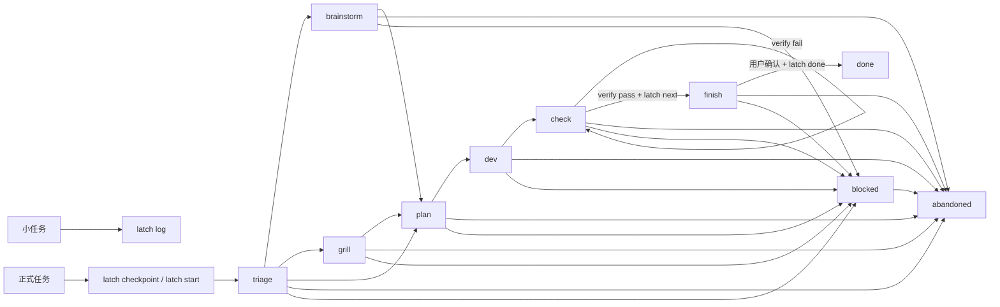

# Latch 使用手册

Latch 是一个项目内任务状态锁存器，用在 AI coding 任务碰到风险域、需要跨会话续接，或者低估为小修后变长的时候。小修、解释代码、单点文案不进入 Latch。

同一项目可以同时保留多个 open task，但只有一个 current task。命令默认操作 current task；需要操作其他任务时使用 `--task <id>` 或先执行 `latch use <id>`。

常见触发语、初始阶段和 checkpoint 示例见 `docs/SCENARIOS.md`。

## 什么时候进入 Latch

分三类判断：

- 风险域任务一开始就进入 Latch：登录、权限、路由、认证、状态流、持久化、API 契约、数据迁移、跨模块职责、难回退 UI 或交互流程。
- 小请求不进入 Latch：单点文案、简单样式、只读解释、低风险单点修复。
- 低估为小修后变长，立刻中途 `checkpoint`：发现影响面扩大、验收不清楚、需要复现 bug 或需要跨会话续接时，立即锁住现场。
- 规划类请求由 AI 自动进入 Latch：例如「规划项目后续」「完善项目」「怎么推进更好」「先讨论路线图」。先 checkpoint，再进入 `brainstorm`；如果涉及安装方式、项目规则、跨项目同步、发布、存储、API 契约、权限或迁移等难回退选择，转入 `grill`。
- Latch 自身接入反馈进入 Latch：AI 找不到 `latch`、只能靠 shell fallback 继续、记录规则漏触发，或用户指出「这应该被记录」。这是产品反馈，不按普通小修处理。

「任务变长时进入」只适用于低估为小修后的补记。能在开始前识别为风险域的任务，应在动手前执行 `latch checkpoint`。

## 一句话规则

任务一旦进入 Latch，就按「记录现场 -> 推进阶段 -> 真实验证 -> 等用户确认 -> 归档」走完。`log` 只给不需要跨会话续接的小任务留一行记录。

## 命令清单

| 命令 | 用途 | 关键点 |
| --- | --- | --- |
| `latch init` | 初始化 `.latch/` | 通常只需执行一次。 |
| `latch start "<title>"` | 创建正式任务 | 可创建多个 open task；没有 current 时自动设为 current。 |
| `latch use <task-id>` | 切换当前任务 | 后续命令默认操作该任务。 |
| `latch checkpoint "<title>" ...` | 低摩擦进入 Latch | 没 current 就创建，有 current 就追加字段，不推进阶段。 |
| `latch save ...` | 保存当前阶段字段 | 只记账，不推进阶段。 |
| `latch next [--to <stage>]` | 推进阶段 | 会检查阶段门禁；进入 `brainstorm`、`grill`、`finish` 时写入模板。 |
| `latch verify -- <command>` | 运行验证命令 | 真实执行命令，按退出码记录 `pass` 或 `fail`。 |
| `latch resume` | 续接当前任务 | 输出任务字段和 `notes.md` 全文。 |
| `latch resume --brief` | 短续接 | 输出任务字段、最近 5 条 events 和 notes 路径。默认优先用这个。 |
| `latch list` | 查看未归档任务 | 列出 `.latch/tasks/` 下的任务，`*` 标出 current。 |
| `latch context [task-id]` | 输出任务上下文 | 给 agent、看板或人读取；支持 `--json`。 |
| `latch log "<summary>"` | 小任务留痕 | 不创建任务，不进状态机。 |
| `latch abandon [--reason "..."]` | 放弃当前任务 | 任意阶段可用，归档现场。 |
| `latch done` | 归档任务 | 只允许在 `finish` 且最近 verify 为 `pass` 时执行。 |

## 常用流程

### 任务变长时进入 Latch

```bash
latch checkpoint "修复登录态过期跳转" \
  --goal "过期登录态统一跳转登录页" \
  --scope "前端路由和接口错误处理" \
  --acceptance "pnpm test 通过；过期后跳登录页" \
  --next "补登录过期跳转测试"
```

`checkpoint` 不代表进入开发阶段。它只锁住现场，默认停在 `triage`。

### 多任务切换

```bash
latch start "修复登录态过期跳转"
latch start "接入看板上下文"
latch list
latch use 2026-07-01-0900-接入看板上下文
```

`start` 可以创建多个 open task。第一个任务会成为 current task；之后创建的新任务不会自动抢走 current，除非使用 `--use`：

```bash
latch start "接入看板上下文" --use
```

`resume`、`save`、`next`、`verify`、`done` 和 `abandon` 默认操作 current task。临时操作其他任务时使用：

```bash
latch next --task 2026-07-01-0900-修复登录态过期跳转
```

### 正常开发流程

```bash
latch resume --brief
latch next
latch save --next "实现最小改动"
latch next
# 修改代码
latch next
latch verify -- pnpm test
latch next
```

验证通过后任务停在 `finish`。只有用户明确确认收尾、完成或归档时，才执行：

```bash
latch done
```

`git commit`、`git push` 和 `latch done` 都不属于默认后续动作。AI 只有在用户明确说「提交」「推送」或「归档」后，才可执行这些命令。

### 放弃当前任务

```bash
latch abandon --reason "影响面太大，暂不继续"
```

`abandon` 用于任务开错、方向变化或外部条件等不到时退出。它不检查阶段和 verify，`blocked` 任务也能直接放弃。原因可选；传入原因时会写入 `events.jsonl` 和 `notes.md`。任务会归档到 `.latch/archive/YYYY-MM/`，已有 verify 结果原样保留。

归档的不是 current task 时，current 不变。归档 current task 后，`current_task_id` 清空，需要继续其他任务时执行 `latch use <id>`。

### 验证失败后的流程

```bash
latch verify -- pnpm exec eslint src/foo.ts
latch save --next "修复 eslint 报错后重新 verify"
```

任务停在 `check`。下一轮先执行：

```bash
latch resume --brief
```

看清失败命令、下一步和 notes 路径，再继续修。

### 小任务只留一行记录

```bash
latch log "限制链路弹窗条件配置为单网口单值" \
  --files src/views/.../LinkDialog.vue,src/views/.../LinkDialogConditionPanel.vue
```

`log` 不创建任务，不跑验证，不推进阶段。同一件事已经 `checkpoint` 或 `start` 后，不再补 `log`；open task 存在时，仍可用 `log` 记录无关小事。

## 阶段流程



```text
triage -> brainstorm? -> grill? -> plan -> dev -> check -> finish -> done
blocked 可从任意阶段进入
abandoned 可从任意 open task 进入
```

| 阶段 | 含义 | 进入或退出条件 |
| --- | --- | --- |
| `triage` | 分流 | 判断直接计划、先发散，还是先追问。 |
| `brainstorm` | 发散讨论 | 用户明确要求先讨论方案、规划项目后续或讨论路线图时进入。 |
| `grill` | 需求追问 | 范围、验收、认证、存储等难回退点不清楚时进入；规划讨论进入执行取舍时也进入。 |
| `plan` | 最小计划 | 需要已有 `goal` 或 `next`。 |
| `dev` | 实现 | 需要已有 `next`。 |
| `check` | 验证 | 实现后进入；必须用 `latch verify -- <command>` 留结果。 |
| `finish` | 收尾等待 | 最近一次 verify 为 `pass` 后进入。 |
| `done` | 已归档 | 用户确认后执行 `latch done`。 |
| `blocked` | 等待外部条件 | 等用户决定、环境、权限或外部系统。 |
| `abandoned` | 已放弃 | 执行 `latch abandon` 后归档，保留现场。 |

## 字段和文件

`.latch/state.json` 只保存 current task 指针：

```json
{
  "current_task_id": "2026-06-30-1430-auth-expiry"
}
```

每个任务目录包含：

```text
.latch/tasks/<task-id>/
  task.json
  notes.md
  events.jsonl
```

归档后移动到：

```text
.latch/archive/YYYY-MM/<task-id>/
```

关键文件用途：

| 文件 | 用途 |
| --- | --- |
| `task.json` | CLI 读取的结构化状态。 |
| `notes.md` | 人和 AI 读取的过程记录、阶段模板和 closure。 |
| `events.jsonl` | 追加事件，用于追溯最近动作。 |

## 方法和边界

### `checkpoint` 和 `save`

`checkpoint` 是进入 Latch 的低摩擦入口。没 current task 时会自动创建任务；有 current task 时只追加字段。

`save` 只保存字段。没有 current task 时会失败。

两者都不推进阶段。

### `next`

`next` 只做阶段推进和门禁检查，不替 AI 写计划、不运行验证。

常见用法：

```bash
latch next
latch next --to grill --reason "验收标准不清楚"
latch next --to brainstorm --reason "用户要求先讨论方案"
```

无 verify 意义的纯文档或 commit 任务，可从规划阶段（`triage`/`brainstorm`/`grill`/`plan`）直接跳级到 `finish`，跳过 `dev`/`check`：

```bash
latch next --to finish --reason "纯文档任务，无 verify 意义"
```

跳级门禁要求 `goal`/`scope`/`acceptance`/`next` 都填齐。`dev` 及之后不跳，要让 `check` 的 verify 把关。跳级后 closure 必须写清「没验证什么」。

### `verify`

`verify` 是唯一记录验证结果的命令。它真实执行后面的命令，并把退出码写入 `task.json` 和 `events.jsonl`。

推荐跑最小相关验证：

```bash
latch verify -- pnpm exec eslint src/foo.ts
latch verify -- pnpm test tests/foo.test.ts
```

项目全量测试有大量既有失败时，不把全量失败当成小修任务的验收门槛。需要在 `notes.md` 的 finish closure 写清没验证什么。

### `resume` 和 `resume --brief`

默认续接使用：

```bash
latch resume --brief
```

它只输出当前任务核心字段、最近 5 条 events 和 notes 路径。需要看完整阶段记录时，再使用：

```bash
latch resume
```

如果 verify 已经 `pass`，但 stage 还不是 `finish`，`resume` 会提示状态矛盾。此时通常应先 `latch next` 推到 `finish`，再等用户确认 `done`。

AI 工具如果在非交互 shell 中报 `command not found: latch`，先试：

```bash
zsh -ic 'latch resume --brief'
```

这通常表示 shell 没加载用户 PATH，不代表 Latch 未安装。不要把本机绝对路径写进项目规则。

如果这类问题发生在 Latch 项目本身，先用可用方式恢复命令，再执行 `latch log` 或 `latch checkpoint` 记录。用户指出漏记时，立即补记并说明原判断。

### `context`

`context` 输出任务上下文，供 agent、看板或人读取。

```bash
latch context
latch context 2026-07-01-0900-修复登录态过期跳转
latch context --brief
latch context --json
```

不给任务 ID 时读取 current task。`--json` 输出稳定 JSON，包含 task ID、title、status、stage、goal、scope、acceptance、next、latest_verify 和 notes_path。

### `done`

`done` 只负责归档，不负责 commit。

执行前必须满足：

- stage 是 `finish`。
- 最近一次 verify 是 `pass`。
- `notes.md` 的 finish closure 已写清改了什么、验证了什么、没验证什么、下次接什么；没有未覆盖范围时写「无」。
- 用户明确确认完成、收尾或归档。

`latch done --help` 只输出帮助，不执行归档。

### `abandon`

`abandon` 只负责放弃并归档当前任务，不负责删除文件、不负责 commit。

```bash
latch abandon
latch abandon --reason "影响面太大，暂不继续"
```

执行前只要求存在 current task，或用 `--task <id>` 指定 open task。任务放弃后：

- `task.status` 和 `task.stage` 写为 `abandoned`。
- 任务目录移动到 `.latch/archive/YYYY-MM/`。
- 如果放弃的是 current task，`state.json` 清空；如果放弃的是其他任务，current 不变。
- 已有 `latest_verify` 保留；原因存在时写入 `events.jsonl` 和 `notes.md`。

### `log`

`log` 用于没进入 Latch 的小任务。它只写 `.latch/log.jsonl`，不会创建任务。

open task 存在时，`log` 仍可记录无关小事。已经进入 Latch 的同一件事不要再补 `log`。

## 推荐给 AI 的续接提示

### 继续当前任务

```text
先运行 latch resume --brief，看当前 stage、next 和最近 verify。只处理 next 指向的范围，不扩大改动；完成后用 latch verify -- <最小相关命令> 记录结果。
```

如果 latch 命令找不到，先用 zsh -ic 'latch resume --brief' 复核交互 shell 是否可用；不要直接改用本机绝对路径。

### 验证已通过后收尾

```text
verify 已经 pass。继续收尾：执行 latch next 到 finish，补 closure，等用户确认后再 latch done。不要扩大改动范围，不要自动 git add。
```

### 真实业务任务验证失败

```text
Latch 现在停在 check，verify 是 fail。只看失败命令和相关报错，修对应文件，再用同一条 latch verify 命令重新验证。
```

## 低 token 用法

- 默认使用 `latch resume --brief`。
- verify 优先跑最小相关命令。
- 失败时只保留关键报错，不反复贴完整日志。
- 长 `notes.md` 只在需要追溯阶段记录时再读。
- 不用完整 diff 替代任务摘要。

正常使用时，Latch 自身通常只消耗几百 token。更大的消耗通常来自完整 diff、全量测试日志和长 notes。

## 不做什么

- 不解析 `notes.md` 判断 closure 写得好不好。
- 不自动 commit。
- 不做 workflow YAML。
- 不内置知识库或长期项目日志。
- 不把 Latch 改成 dashboard。
- 不直接删除 abandoned 任务。

需要把归档任务写入长期知识库时，由外部工具读取 `.latch/archive/` 后自行整理；Latch 只维护当前任务状态、事件和验证结果。
