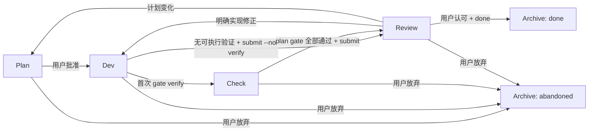

# Latch v2：显式任务、计划批准与验收循环

Source-Task: 202607090959-根治-latch-漏触发与重复修补

Decision-Status: approved

Document-Status: approved

Date: 2026-07-10

Revision: 2

Revised: 2026-07-11

Approved: 2026-07-12

Review-Task: 202607101647-修订-latch-v2-契约并补强-slice-1-故障恢复

## 1. 背景

Latch v1 已经证明以下能力有价值：

- 在本地保存正式 coding task 的当前状态；
- 跨 AI 会话读取目标、范围、验收和下一步；
- 真实执行验证命令并记录结果；
- 在用户确认后归档；
- 通过 Latch-Board 查看多个项目的任务。

但 v1 在短时间内叠加了过多职责：

- 根据自然语言自动判断是否创建任务；
- `triage`、`brainstorm`、`grill` 等 AI 思考阶段；
- actor current、task owner、`--force` 和全局锁；
- `start`、`checkpoint`、`resume`、`context` 等重复入口；
- 小修改 `log`；
- knowledge card、module card 和知识门禁；
- 多份 skill、项目规则和文档快照；
- Board 侧重复实现阶段机和门禁。

真实业务使用暴露了三个主要问题：

1. AI 会漏掉或误判自动触发规则。
2. task 已创建不代表方案已经得到用户确认，AI 仍可能直接开始实现。
3. AI 提交后，用户经常发现方案或实现问题并进行多轮修改；这属于正常验收循环，不是异常 reopen。

v2 不继续修补 v1，而是收缩到个人日常 coding workflow 的最小职责。

## 2. 产品定位

Latch v2 是用户显式调用的本地 coding task 状态记录器。

它只负责：

- 用户明确创建或续接任务；
- 保存当前 plan；
- 记录用户对 plan 的实施批准；
- 保护同一 task 的并发状态写入；
- 允许不同 task 在同一 Git worktree 独立推进，并提示共享风险；
- 执行并记录命名验证项；
- 提交当前实现供用户 review；
- 记录用户反馈和返工轮次；
- 用户明确认可后归档；
- 通过 artifacts 连接项目文档；
- 为只读 Latch-Board 提供稳定 JSON。

Latch v2 是个人工具，不是团队项目管理平台，也不是 AI workflow runtime。

## 3. 支持范围

只支持当前个人环境：

- macOS；
- Node.js 22 或更高；
- pnpm；
- 本地文件系统；
- 本地 Git repo；
- Codex、Claude Code、OpenCode 通过同一个全局 skill 使用。

不承诺：

- Windows 或 Linux 通用发行；
- npm 公共发布；
- 远程访问；
- 多用户服务；
- 向后兼容 v1 数据和命令。

## 4. 设计原则

### 4.1 用户决定任务分流

AI 不判断一条请求是否「应该」进入 Latch。只有用户明确提到 `Latch` 时才落盘。

### 4.2 创建不等于批准实现

所有 Latch task 必须先形成 plan 并等待用户批准。没有直接实现捷径。

### 4.3 用户反馈是主流程

AI 提交实现后进入 `review`。用户可以要求实现修正、修改计划或认可归档。

### 4.4 每个事实只有一个当前真源

- 当前状态在 `task.json`；
- 历史在 `events.jsonl`；
- 长期知识在 Git 跟踪的项目文档；
- Board 只消费 CLI JSON，不重新计算规则。

### 4.5 `.latch` 可删除

`.latch` 是本地运行状态，不是项目长期知识真源。重要内容必须进入 Git 跟踪的文档。

### 4.6 拒绝静默冲突

同一 task 的过期写入直接失败并要求重读，不自动合并。

## 5. 用户协议

### 5.1 创建新任务

以下表达固定表示创建新 task：

```text
走 Latch
创建一个 Latch 任务
把这件事记录到 Latch
```

AI 根据请求生成 title、goal 和初始 plan，但不能改成续接已有任务。

### 5.2 继续当前任务

```text
继续 Latch
继续当前 Latch 任务
```

读取当前 session 的 `current_task_id`。没有 current 时展示 open task，但不得自行选择或新建。

### 5.3 继续指定任务

```text
继续 Latch 任务 <id>
接手 Latch 任务 <id>
```

读取指定 task，并设置为当前 session 的 current。

### 5.4 AI 建议使用 Latch

AI 可以在明显复杂、风险较高或可能跨会话的任务前建议一次：

```text
建议走 Latch；如需记录，请明确回复「走 Latch」。
```

AI 不得自行创建。用户明确拒绝后，本次不重复建议。

### 5.5 计划批准

所有 Latch task 都必须展示 plan 并等待批准。

有效授权：

```text
开始实现
按这个计划做
就按这个方案执行
可以进入开发
```

如果 AI 上一句只问：

```text
确认按上述 plan 开始实现吗？
```

用户紧接着回答「可以」「确认」「按你的方案」，也算授权。

以下表达不算实施授权：

```text
这个思路可以
继续分析
大体没问题
先看看
你再想想
```

### 5.6 归档授权

有效归档授权必须明确包含完成、归档或结束 Latch task：

```text
任务完成，归档
可以归档
结束这个 Latch 任务
归档任务 <id>
```

单独的「可以」「确定」「继续」「按这个做」「没问题」不算归档。

如果 AI 上一句只问是否归档当前 task，用户回答「可以」或「确认」，可以执行 `done`。

### 5.7 放弃授权

只有用户明确表达放弃、取消或不再继续时才能 `abandon`。

AI 不得因为以下原因自动放弃：

- 长时间未继续；
- 等待后端；
- verify 失败；
- 用户切换话题；
- task 被另一张 task 替代；
- AI 认为价值不高。

## 6. Plan 规则

### 6.1 Plan 长度

计划长度按复杂度控制。

简单 task 约 5 行：

- 目标；
- 改动范围；
- 实现办法；
- 验证方式；
- 未决问题。

中等 task 应覆盖：

- 用户可见结果；
- 涉及模块；
- 现有实现复用；
- API、数据和权限假设；
- 用户操作流程；
- 不做范围；
- 验证方式；
- 未决问题。

大任务或难回退设计才写 brief 或 ADR。

### 6.2 Plan 当前字段

```ts
type TaskPlan = {
  goal: string
  scope: string[]
  acceptance: string[]
  approach: string[]
  api_assumptions: string[]
  permission_assumptions: string[]
  data_assumptions: string[]
  user_flow: string[]
  out_of_scope: string[]
  verification_plan: Array<{
    name: string
    command: string[]
    kind: 'gate' | 'diagnostic'
  }>
  open_questions: string[]
}
```

`verification_plan` 中的 name 必须唯一。`open_questions` 只保存会阻止实施批准的问题；非阻塞备注使用 decision event 或项目文档。

### 6.3 Plan revision

首次完整且通过 schema 校验的 plan，其 `plan_revision` 为 1。

CLI 不判断文字变化是否「实质」。任一 plan 字段的持久化值发生变化时：

- `plan_revision + 1`；
- 旧 implementation approval 失效；
- 旧 gate 和 submission 失效；
- phase 回到 `plan`；
- 必须重新展示并等待批准。

数组顺序属于持久化值的一部分，调整顺序也会增加 revision。`approve` 只接受 `open_questions` 为空的 plan。

## 7. 父文档与实现 task

PRD、brief 和 ADR 可以通过 artifact 连接到 implementation task，但 v2 首版不继承父 task 的实施批准。

每张 implementation task 必须：

- 把来源 PRD 或 brief 记录为 artifact；
- 保存本 task 的完整 plan；
- 单独获得一次 direct implementation approval；
- 偏离来源文档时先修改 plan，并重新批准。

这样会多一次确认，但避免引入父 task 可读性、slice 结构化复制、跨 task 失效传播和任务关系模型。

v2 不实现：

- `approved_plan_slice`；
- `source_task_id` 驱动的批准继承；
- 通用任务树、依赖图、自动创建和进度汇总。

v2 跑满 10 个真实 task 后，再根据重复审批的实际成本评估是否需要 slice 授权。

## 8. 生命周期

### 8.1 阶段

只保留四个 open phase：

```text
plan -> dev -> check -> review
```

归档结果：

```text
done | abandoned
```

`blocked` 不是 phase，而是 task 当前状态上的可选原因。

### 8.2 状态图



纯文档和规划 task 也必须先批准，再进入 dev。`--no-verify` 只表示当前 plan 没有可执行 gate，不表示跳过实施批准。

### 8.3 Work revision

每次进入一轮实现，`work_revision + 1`：

- 首次 plan approval；
- review 中的明确实现修正。

work revision 改变后：

- 旧 gate 标记为 stale；
- 旧 submission 不再代表当前实现；
- phase 进入 `dev`。

首次 gate verify 使 `dev -> check`。gate 失败后保持 `check`，允许在同一 work revision 中修正并重跑。

## 9. 用户反馈分流

### 9.1 Directive correction

用户给出明确修改目标，且不改变已批准 plan：

```text
把裸箭头换成 Element Plus 图标
这里改用 descriptions
使用后端的 nic_num 字段
```

处理：

- AI 用一行说明按实现修正处理；
- 不二次确认；
- `review -> dev`；
- plan revision 和 approval 保持；
- work revision 增加；
- 旧 gate 失效。

### 9.2 Evaluative feedback

用户只表达不接受，没有可执行目标：

```text
这个页面很丑
这里感觉有问题
交互不是我想要的
```

处理：

- AI 先只读诊断；
- 给一个短判断；
- 只问一个具体问题；
- 不修改代码。

### 9.3 Plan change

反馈改变以下任一内容：

- goal；
- scope；
- acceptance；
- API、权限或数据契约；
- 用户流程；
- 原方案的重要保留或删除边界。

处理：

- `dev/review -> plan`；
- plan revision 增加；
- approval 和 gate 失效；
- 更新 plan 后重新批准。

### 9.4 无法分类

AI 必须先问一个问题，不得自行选择。

## 10. 外部依赖与阻塞

等待后端字段、需求确认、权限或环境时：

```ts
type BlockedState = {
  reason: string
  waiting_for: string
  blocked_at: string
}
```

规则：

- 不改变当前 phase；
- 不自动 abandon；
- blocked 的 dev/check/review task 仍属于共享 worktree 风险提示的活动 task；
- 外部答复改变 plan 时按 plan change 处理；
- 修改 plan 不自动清除 blocked，必须显式 unblock。

blocked 时允许：

- `list`、`context`、`use`；
- `save --unblock`；
- 更新 plan；
- `abandon`。

blocked 时默认拒绝：

- `approve`；
- `verify`；
- `submit`；
- `done`。

## 11. 共享 worktree 风险

同一个 `workspace_root` 可以有多张 task 同时处于 `dev`、`check` 或 `review`，包括 blocked task。不同 task 的 `approve` 只更新目标 task，自身 revision、approval、gate 和 submission 约束不变。

`approve` 发现其他活动 task 时仍成功，并在结果中返回非阻塞 warning。Latch 不要求 clean worktree、不跟踪文件归属，也不自动 commit；warning 不证明或改变 Git diff 的隔离情况。

验证命令始终针对整个 workspace。真正需要代码隔离时，由用户选择外部 Git worktree；v2 不创建、合并或删除 worktree。

## 12. 并发与写入模型

### 12.1 Current task 与 actor

`state.json` 只保存每个 actor 的 current task：

```ts
type LatchState = {
  schema_version: 2
  actors: Record<string, {
    current_task_id?: string
  }>
}
```

删除顶层 legacy current、active task、task owner 和 `--force`。

actor 的可靠来源是调用方显式设置的 `LATCH_ACTOR`，推荐格式为 `<tool>:<session-id>`。平台不能提供稳定 session ID 时，允许退化为客户端级 actor，但 human 输出必须提示 current 可能由多个会话共享。

actor 只作为 `state.json` 的 current key 和 task event 的追溯字段，不进入 task owner。

`use` 只修改 state，不追加 task event，也不增加 task revision。

### 12.2 Revision

每张 task 有单调递增的 `revision`。

所有修改既有 task 的命令必须携带 `--expect-revision`。`init`、`checkpoint` 和 `use` 不修改既有 task，因此不需要 task revision。

版本不一致时拒绝，且不修改 task、event 或 state：

```text
Task changed: expected revision 12, current revision 13.
Changed by: codex:session-a.
Run latch context <id> --json --brief and retry.
```

不自动合并字段。每个成功修改既有 task 的命令都返回 previous revision 和新 revision，避免调用方额外执行一次 context。

### 12.3 锁

- task 使用 per-task 短锁；
- state 使用独立短锁；
- 不同 task 可以并行写；
- 锁文件记录 PID 和创建时间；
- 过期锁只在 PID 已不存在时清理；
- 不新增用户清锁命令。

需要组合锁时固定顺序：

```text
task -> state
```

### 12.4 单文件原子写

JSON 文件使用：

```text
写同目录临时文件
→ fsync/close
→ rename 覆盖目标
→ fsync 父目录
```

参数、schema 和 revision 必须在任何 Latch 持久化副作用前验证。

### 12.5 多文件提交点与恢复

Latch 不实现通用事务框架。多文件操作采用明确的主真源和可修复索引：

- task 更新以 `task.json` 原子替换成功为提交点；
- `events.jsonl` 是历史，不参与当前门禁判断；
- event 追加失败时，task 更新仍算成功，命令返回 warning，不得表现为「未修改」；
- `context` 检测 1 到当前 task revision 的 event 覆盖不完整时，返回 `history_incomplete: true`；event 文件损坏或无法读取仍按文件错误报告；
- archive 以 task 目录成功 rename 到 archive 为提交点；
- archive 后清理 state current；清理失败时归档仍算成功并返回 warning；
- current 指向不存在的 open task 时按无 current 处理，不静默选择其它 task；
- `done` 重试遇到相同 ID 和 outcome 的已归档 task 时返回幂等成功。

进程在 `task.json` 与 event 追加之间被强制终止时，允许历史少一条 event，但 task 当前事实不能回退或由 events 反推。

## 13. Root 发现

Git repo 中：

1. 先用 `git rev-parse --show-toplevel` 确定当前 Git root；
2. 只在 cwd 到该 Git root 之间查找已有 `.latch/`；
3. 不跨越 Git root 使用父 repo 的 `.latch/`；
4. 没有 `.latch/` 时使用当前 Git root。

非 Git 目录中：

1. 可以向上复用已有 `.latch/`；
2. 没有已有 `.latch/` 时，只有 `latch init` 使用当前目录；
3. `list`、`context` 等读命令不得创建 `.latch/`。

所有路径使用 realpath 规范化，避免 macOS `/var` 与 `/private/var` 表示差异。

## 14. CLI 命令

v2 首版只保留 11 个命令。

### 14.1 `init`

```bash
latch init
```

初始化 v2 `.latch`。发现 v1 数据时直接报错，不迁移、不覆盖。

### 14.2 `checkpoint`

```bash
latch checkpoint "<title>" --plan-file /path/to/plan.json
```

职责：

- 永远创建新 task；
- title 必填；
- ID 使用毫秒时间 + slug + 短随机后缀；
- 设置当前 actor 的 current task；
- phase 为 plan；
- 不更新已有 task；
- 删除 `--new`；
- `--plan-file` 必须提供完整且通过 schema 校验的 TaskPlan。

### 14.3 `use`

```bash
latch use <task-id>
```

解析唯一前缀后，把 canonical 完整 ID 写入当前 actor state。不改变权限或 task 元数据。

### 14.4 `list`

```bash
latch list
latch list --json
latch list --json --brief
```

按创建时间排序，返回 open task 和当前 actor current。

### 14.5 `context`

```bash
latch context
latch context <task-id>
latch context <task-id> --json --brief
latch context <task-id> --json
```

只读输出当前状态、revision、plan、approval、blocked、verification、submission、artifacts 和最近 events。

删除 `resume`。

### 14.6 `save`

```bash
latch save <task-id> \
  --expect-revision 5 \
  --plan-file /path/to/plan.json

latch save <task-id> \
  --expect-revision 6 \
  --decision "采用独立 v2 CLI" \
  --artifact brief:docs/briefs/example.md

latch save <task-id> \
  --expect-revision 7 \
  --block-reason "等待后端字段" \
  --waiting-for "后端确认"

latch save <task-id> --expect-revision 8 --unblock
```

职责：

- 使用完整 `--plan-file` 更新 plan，或更新普通字段；
- 追加 decision event；
- 使用 `--artifact` 添加 artifact，使用 `--remove-artifact` 移除；
- 设置或清除 blocked reason；
- 任一 plan 持久化值变化时增加 plan revision，并使 approval、gate、submission 失效；
- 不创建 task；
- 不推进普通 phase，计划变化回到 plan。

### 14.7 `approve`

首次实施：

```bash
latch approve <task-id> \
  --expect-revision 7 \
  --reason "用户确认按当前 plan 实现"
```

review 实现修正：

```bash
latch approve <task-id> \
  --expect-revision 14 \
  --feedback "实时指标改用 Element Plus 图标"
```

职责：

- plan 中记录 implementation approval，进入 dev；
- review 中记录 directive correction，保持 plan approval，增加 work revision，进入 dev；
- 其他 dev/check/review task 只返回共享 worktree warning，不阻止批准；
- 使旧 gate/submission 失效；
- 首版 implementation approval 只支持 direct user approval。

### 14.8 `verify`

```bash
latch verify <task-id> --expect-revision 9 --name typecheck
latch verify <task-id> --expect-revision 10 --name tests
latch verify <task-id> --expect-revision 11 --diagnostic --name exploratory -- pnpm typecheck
```

规则：

- 首次 gate verify 时 `dev -> check`；
- 同名验证覆盖该名称的最新结果；
- 不同名称互不覆盖；
- 结果绑定当前 work revision；
- 普通 `--name` 必须对应已批准 plan 的验证项，并执行其中保存的 argv；
- plan 中全部 gate 都有当前 work revision 的 pass 结果后才能 submit；
- ad hoc diagnostic 可以在 `--` 后提供 argv，不参与门禁；
- 真实执行一个进程，不经过 shell。

### 14.9 `submit`

代码任务：

```bash
latch submit <task-id> \
  --expect-revision 18 \
  --changes "..." \
  --unverified "未做浏览器验收"
```

纯文档或规划任务：

```bash
latch submit <task-id> \
  --expect-revision 4 \
  --no-verify \
  --reason "只输出设计文档，没有运行时修改" \
  --changes "新增 ADR" \
  --unverified "未运行代码测试"
```

职责：

- gate task 只允许 `check -> review`；
- no-verify task 只允许已批准后的 `dev -> review`；
- verified 摘要由当前结构化 verification 自动生成，不接受自由填写；
- 保存当前 work revision 的 submission；
- submission 不是最终 closure；
- 删除 `finish`。

### 14.10 `done`

```bash
latch done <task-id> --expect-revision 20 --followup "..."
```

职责：

- 只允许 phase=review；
- 检查 submission 对应当前 work revision；
- 检查 gate 仍有效，或本轮是有效 no-verify submission；
- AI 使用协议必须已有明确用户归档授权；
- 把最新 submission 固化为最终 closure；
- outcome=done；
- 移入 archive。

CLI 不解析自然语言授权。

### 14.11 `abandon`

```bash
latch abandon <task-id> \
  --expect-revision 8 \
  --reason "用户决定不再继续"
```

职责：

- AI 使用协议必须已有明确用户放弃授权；
- outcome=abandoned；
- 保存 reason；
- 移入 archive。

## 15. 删除的 v1 能力

删除且不保留兼容壳：

- `start`；
- `next`；
- `resume`；
- `log`；
- `knowledge` 全部子命令；
- `finish`；
- `done --all`；
- `--new`；
- `--force`；
- `triage`；
- `brainstorm`；
- `grill`；
- `blocked` phase；
- `status` 与 `stage` 双字段；
- owner 权限；
- knowledge decision；
- knowledge card/module card；
- 自动 scaffold；
- 自动 `notes.md`；
- v1 schema fallback；
- v1 archive 读取。

## 16. Task schema v2

```ts
type TaskPhase = 'plan' | 'dev' | 'check' | 'review'
type TaskOutcome = 'done' | 'abandoned'

type VerifyResult = {
  name: string
  kind: 'gate' | 'diagnostic'
  command: string[]
  status: 'pass' | 'fail'
  exit_code: number
  work_revision: number
  created_at: string
}

type TaskArtifact = {
  kind: 'adr' | 'brief' | 'architecture' | 'runbook' | 'doc' | 'commit' | string
  path: string
}

type TaskV2 = {
  schema_version: 2
  id: string
  title: string
  phase: TaskPhase
  outcome?: TaskOutcome

  revision: number
  plan_revision: number
  work_revision: number

  workspace_root: string
  plan: TaskPlan

  implementation_approval?: {
    approved_plan_revision: number
    approved_at: string
    source: 'user'
    reason: string
  }

  blocked?: BlockedState

  verification: {
    gate: Record<string, VerifyResult>
    diagnostic: Record<string, VerifyResult>
  }

  submission?: {
    work_revision: number
    changes: string
    verified: string
    unverified: string
    no_verify?: {
      reason: string
    }
    submitted_at: string
  }

  closure?: {
    changes: string
    verified: string
    unverified: string
    followup: string
    accepted_at: string
  }

  artifacts: TaskArtifact[]

  created_at: string
  updated_at: string
}
```

`submission.verified` 和 `closure.verified` 由结构化 verification 生成；它们是人读摘要，不接受调用方自由填写。

## 17. Events

v2 不保存完整聊天，不生成 notes.md。

必须支持的 task event：

```text
task_created
plan_updated
artifact_updated
decision_recorded
implementation_approved
work_started
review_feedback
blocked
unblocked
verification_run
submitted
done
abandoned
```

`use` 只修改 state，不写 `current_selected` task event。revision conflict 不修改任何文件，只通过 stderr、非 0 退出码和调用方日志报告。

每条 event 至少包含：

```ts
type BaseEvent = {
  type: string
  task_id: string
  actor: string
  revision: number
  created_at: string
}
```

关键 event 保存结构化摘要：

```ts
type DecisionEvent = BaseEvent & {
  type: 'decision_recorded'
  plan_revision: number
  question?: string
  answer?: string
  conclusion: string
}

type ReviewFeedbackEvent = BaseEvent & {
  type: 'review_feedback'
  plan_revision: number
  work_revision: number
  classification: 'implementation_correction' | 'evaluative' | 'plan_change'
  summary: string
}
```

不保存完整 prompt、AI 思考过程、完整 diff、完整命令输出、普通确认和闲聊。

## 18. 验证模型

### 18.1 Gate

- plan 中 gate name 唯一；
- `verify --name` 执行已批准 plan 保存的 argv；
- 按 name 保存当前 work revision 的最新结果；
- plan 中至少一项 gate；
- plan 中全部 gate 都 pass 才能 submit；
- work revision 或 plan revision 改变后全部 stale。

### 18.2 Diagnostic

- plan diagnostic 也可以按 name 执行；
- ad hoc diagnostic 允许显式 argv；
- 单独保存，不影响 submit；
- submission 的 unverified 中说明失败和未覆盖范围。

### 18.3 No verify

只允许已批准 plan 后从 dev submit，并必须提供 reason。当前 plan 不得包含 gate。

No verify 是 task.json 当前 submission 的结构化字段，不通过 events 推断。

## 19. Git 边界

`done` 与 Git commit 完全独立。

Latch 不：

- 要求 clean worktree；
- 自动 add/commit/push；
- 自动创建 branch/worktree；
- 根据 dirty 阻止归档；
- 推断 dirty 文件属于哪张 task。

用户明确要求 Git 操作时单独执行。可选 commit SHA 通过 artifact 记录，不是门禁。

## 20. 文档发现

每个项目使用 `docs/INDEX.md` 作为文档入口。

AI 固定读取顺序：

1. 当前 task artifacts；
2. AGENTS 中的文档入口；
3. `docs/INDEX.md`；
4. 当前任务相关的 1–3 份文档；
5. 不足时再搜索源码和 archive。

长期有效文档加入 INDEX，并由 task artifact 引用。

不做：

- 自动扫描；
- 自动总结；
- 向量检索；
- knowledge card；
- 跨 repo 搜索服务。

## 21. Skill 与项目规则

只保留一个 canonical skill：

```text
Latch/skills/latch/SKILL.md
```

全局目录通过符号链接指向它：

```text
~/.codex/skills/latch
~/.agents/skills/latch
```

删除 repo 内 Latch skill 副本和全局 docs 快照。

业务项目 AGENTS 只保留：

- 明确提到 Latch 才进入；
- 使用全局 skill；
- 项目专属验证、禁改目录和架构规则。

CLAUDE 默认只保留：

```markdown
@AGENTS.md
```

## 22. Latch-Board 边界

Latch-Board 保留，长期只读。

保留：

- 多项目 task 列表；
- plan/approval/revision；
- blocked reason；
- verify；
- submission/review；
- feedback timeline；
- archive；
- artifacts 和 docs index；
- 数据源状态。

删除或重做：

- Knowledge 页面；
- v1 流程图；
- owner 展示；
- Board 内 progress/gate reducer；
- open task 文件 fallback；
- 对 triage/brainstorm/grill/blocked/finish 的耦合。

open task 状态只消费 Latch CLI 稳定 JSON。archive 可以读取不可变归档 JSON。

Board 不执行 approve、submit、done 或 abandon。

## 23. JSON 契约

所有机器可读输出包含：

```ts
type JsonEnvelope = {
  schema_version: 2
  generated_at: string
}
```

修改命令返回：

```ts
type MutationEnvelope = JsonEnvelope & {
  task_id: string
  previous_revision?: number
  revision?: number
  phase?: TaskPhase
  warnings: string[]
}
```

`checkpoint` 没有 previous revision，`use` 不返回 task revision。warning 表示主操作已经按提交点生效，但 event 或 state 索引需要检查；不能用非 0 退出码伪装成完全未生效。

### 23.1 `list` JSON

`list --json` 按 `created_at` 从旧到新返回：

```ts
type TaskSummary = {
  id: string
  title: string
  phase: TaskPhase
  revision: number
  plan_revision: number
  work_revision: number
  blocked?: BlockedState
  created_at: string
  updated_at: string
}

type ListJson = JsonEnvelope & {
  current_task_id?: string
  tasks: TaskSummary[]
}
```

`list --json --brief` 的每项只保留 `id`、`title`、`phase`、`revision`、可选 `blocked` 和 `updated_at`。

### 23.2 `context` JSON

`context --json` 返回：

```ts
type ContextJson = JsonEnvelope & {
  current: boolean
  task: TaskV2
  recent_events: TaskEvent[]
  history_incomplete: boolean
}
```

full JSON 返回当前 task 的全部 event；`context --json --brief` 只返回最近 5 条 event，并把 task 压缩为：

- id、title、phase；
- task、plan、work revision；
- goal、scope、acceptance、open questions；
- approval、blocked、verification、submission；
- artifacts 和 updated time。

brief 不返回完整 approach、API/权限/数据假设、user flow 和 out of scope。可选字段不存在时省略，不写 `null`。

### 23.3 JSON 错误

带 `--json` 的命令失败时，以非 0 退出码向 stderr 写：

```ts
JsonEnvelope & {
  error: {
    code: string
    message: string
  }
}
```

human 输出不承诺稳定解析。Board 遇到未知 schema version 时明确报错，不回退猜测。

## 24. 错误处理

必须满足：

- 未知命令和 flag 退出非 0；
- 参数、schema 或 revision 错误在任何写入前报错；
- ID 前缀解析后只保存完整 ID；
- 同标题不会覆盖；
- revision conflict 和锁冲突不修改任何文件；
- verify command not found 时保存明确失败结果；
- JSON 损坏时错误包含文件路径，不静默返回空值；
- list/context 在未初始化目录无副作用；
- task 创建、更新后的 event 追加失败不改变 task 已提交事实，返回 warning；
- checkpoint 的 current state 写入失败不撤销已创建 task，返回 warning；
- archive 后 state 清理失败不撤销归档，返回 warning；
- current 指向不存在的 open task 时返回无 current；
- done 对相同 outcome 的已归档 task 可幂等重试。

## 25. 数据清理、发布与回退

v2 不迁移 v1。

第一阶段只修改 Latch repo tracked 文件：

- 不更新全局 CLI；
- 不切换全局 skill；
- 不删除当前 `.latch`；
- 不修改 Latch-Board、appearance-sec 或 monitoring。

第一阶段的 v2 CLI 使用独立入口和临时目录验证，保持全局 v1 CLI 与完整 v1 测试可用。正式切换前记录：

- v1 CLI 的 Git commit 或可恢复安装路径；
- 当前全局 skill 链接或副本位置；
- Latch-Board 当前 commit；
- 三个 repo 的 v1 `.latch` 备份位置与校验结果。

第二阶段顺序：

1. 备份三个 repo 的 v1 `.latch`；
2. 保存可直接恢复的 v1 CLI 和 skill 信息；
3. 更新全局 CLI 与 canonical skill；
4. 初始化 Latch repo v2 并做 smoke test；
5. 更新 Latch-Board；仍为 v1 的项目显示「暂不支持」，不显示为数据损坏；
6. 用户逐个确认后更新 appearance-sec、monitoring；
7. 每个接入项目至少完成一张真实 v2 task，累计达到 10 张后再删除 v1 备份。

任一步失败时按相反顺序恢复 Board、全局 skill、全局 CLI 和项目 `.latch`。恢复不依赖 v2 migration。

## 26. 非目标

v2 明确不做：

- 自动任务分类和创建；
- 同题语义查重；
- 直接实现捷径；
- 通用 `next`；
- brainstorm/grill/blocked 持久阶段；
- task hierarchy、依赖图、排期、百分比；
- 自动子任务创建；
- knowledge、log、journal；
- 完整聊天保存；
- 自动项目扫描和文档生成；
- 向量库、embedding、RAG；
- 自动 Git 操作；
- 自动 worktree；
- 自动清理陈旧 task；
- Board 写操作；
- hook 编排；
- SessionStart/UserPromptSubmit 注入；
- 云备份、同步、导出；
- 多用户、远程访问、登录权限；
- 跨平台发行和公共 npm 发布；
- v1 兼容和通用 migration framework。

新想法等 v2 跑满 10 个真实 task 后单独讨论。

## 27. 验收标准

### 27.1 用户协议

- 未明确出现 `Latch` 时创建 task 数为 0；
- 「走 Latch」创建新 task；
- 「继续 Latch」只续接 current；
- 「继续 Latch <id>」只续接指定 task；
- 所有 implementation task 在 dev 前都有 direct approval；
- 模糊认可不会触发 approve、done 或 abandon。

### 27.2 状态与并发

- 同标题 task 不覆盖；
- state 只保存 canonical 完整 ID；
- 同一 task 过期 revision 写入失败且无副作用；
- 不同 task 可以并行写状态；
- 两张不同 task 并发 approve 均可成功，各自只更新自己的 task 和 events；
- 同一 workspace 可以有多张 dev/check/review task；
- blocked task 仍会触发共享 worktree warning；
- plan/work revision 正确使 approval、gate、submission 失效；
- 删除 events 后仍能从 task.json 判断当前门禁；
- 不生成 notes.md。

### 27.3 验证与 review

- plan 中 gate name 唯一；
- verify 执行已批准 plan 保存的 argv；
- plan 中任一 gate 未通过时不能 submit；
- diagnostic fail 不阻塞 submit；
- no-verify 必须先 approval，plan 不含 gate 且 reason 非空；
- review correction 回 dev，不使 plan approval 失效；
- plan change 回 plan，使 approval 和 gate 失效；
- done 只接受当前 work revision 的 submission。

### 27.4 文件安全与恢复

- 参数错误不产生 task；
- revision conflict 不写文件或 event；
- JSON 使用原子写；
- Git repo 不跨 Git root 发现父 `.latch`；
- task 创建或更新后的 event 追加失败返回 warning，task 当前事实保持可读；
- checkpoint current 写入失败返回 warning，已创建 task 仍可按 ID 使用；
- archive state 清理失败后归档仍可读取，stale current 不生效；
- done 对已归档的相同 outcome 幂等；
- list/context 在未初始化目录无副作用；
- 未知命令和 flag 非 0 退出。

### 27.5 文档与 skill

- canonical skill 只有一个源目录；
- 两个全局链接可检查；
- repo 内无 Latch skill 副本；
- `docs/INDEX.md` 是当前文档入口；
- v1 active 文档明确标记为 current-v1 或 superseded；
- Latch-Board 不包含重复门禁 reducer。

### 27.6 发布边界

- 第一阶段没有修改外部 repo 或全局安装；
- 第二阶段每个外部 repo 都需用户单独确认；
- v1 CLI、skill、Board 和 `.latch` 都有明确恢复步骤；
- 每个接入项目至少完成一张真实 v2 task；
- v1 备份在累计 10 个真实 task 验证后删除。

## 28. 成功指标

### 28.1 自动验收指标

- 未批准进入 dev：0；
- 同一 workspace 出现两张 dev/check/review task：0；
- 重复 task ID：0；
- 过期 revision 写入：0；
- 悬空 current 生效：0；
- schema mismatch 被静默回退：0；
- Board 重复计算门禁：0。

### 28.2 人工观察指标

前 10 个真实 task 在 Git 跟踪的试运行记录中登记：

- 显式创建漏执行次数；
- plan 确认后仍因理解错误返工的次数；
- implementation correction 轮次；
- plan change 轮次；
- revision conflict 次数；
- event/state warning 次数；
- skill/docs 漂移。

人工观察项不能只靠 `.latch` 推断，因为 v2 不保存完整聊天。10 个 task 至少覆盖 correction、plan change、blocked、revision conflict、no-verify、多 gate 和跨会话读取，并且每个接入项目至少一张。

达到观察条件后，再评估 archive 搜索、worktree 记录、slice 授权或其它新能力。
